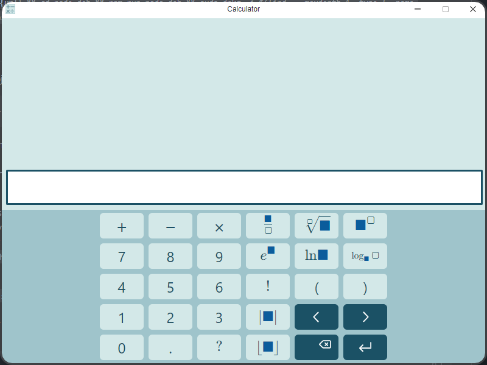

# IVS_projekt_2

<p align="center">
  
</p>

## Zadanie
Zadanie projektu je v textovej forme dostupné [tu](https://ivs.fit.vutbr.cz/projekt-2_tymova_spoluprace2023-24.html)

## Inštalácia
Táto inštalácia bude fungovať iba pokiaľ Vaša distribúcia Linuxu podporuje debian balíky.\
Všetky závislosti by mali byť automaticky nainštalované.

### Postup
Stiahnite si .deb balíček [tu]()\
V príkazovom riadku otvorte lokáciu, kde sa balík nachádza a vykonajte nasledujúci príkaz
```
dpkg -i placeholder.deb
```
### Spustenie
Pre spustenie programu využite príkaz
```
placeholder
```
### Odinštalácia
Pre odinštalovanie použite príkaz
```
dpkg -r placeholder
```

## Prostredie
Ubuntu 64bit

## Autori
SCH Software
* **xjenisf00** - Filip Jenis
* **xbohach00** - Hugo Bohácsek
* **xdubnis00** - Štefan Dubnička
* **xklcovl00** - Lucia Klčová

## Licencia
Meno: Jednoduchá kalkulačka\
Copyright (C) 2024 Filip Jenis, Hugo Bohácsek, Štefan Dubnička, Lucia Klčová

Tento program je slobodný softvér: môžete ho šíriť a upravovať podľa ustanovení Všeobecnej verejnej licencie GNU (GNU General Public Licence), vydávanej nadáciou Free Software Foundation a to buď podľa 3. verzie tejto Licencie, alebo (podľa vášho uváženia) ktorejkoľvek neskoršej verzie.

Tento program je rozširovaný v nádeji, že bude užitočný, avšak BEZ AKEJKOĽVEK ZÁRUKY. Neposkytujú sa ani odvodené záruky PREDAJNOSTI alebo VHODNOSTI PRE URČITÝ ÚČEL. Ďalšie podrobnosti hľadajte vo Všeobecnej verejne licencii GNU.

Kópiu Všeobecnej verejnej licencie GNU ste mali dostať spolu s týmto programom. Ak sa tak nestalo, nájdete ju tu: <http://www.gnu.org/licenses/>.