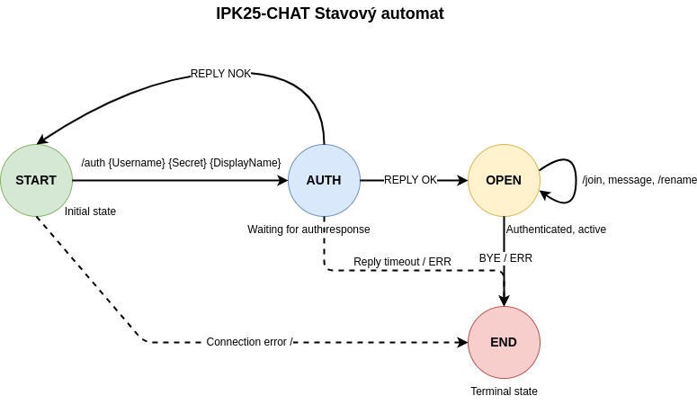

# IPK Projekt 2: Klient pre chatovací server používajúci protokol IPK25-CHAT

**Autor**: Hugo Bohácsek (xbohach00)  
**Dátum**: 17. apríla 2025

## Obsah
- [Úvod](#úvod)
- [Teória](#teória)
  - [Rozdiely medzi transportnými protokolmi](#rozdiely-medzi-transportnými-protokolmi)
  - [Protokol TCP](#protokol-tcp)
  - [Protokol UDP](#protokol-udp)
- [Implementácia](#implementácia)
  - [Prehľad architektúry](#prehľad-architektúry)
  - [Štruktúra zdrojového kódu](#štruktúra-zdrojového-kódu)
  - [Stavy klienta](#stavy-klienta)
  - [Spracovanie správ](#spracovanie-správ)
  - [Spracovanie variantov protokolu](#spracovanie-variantov-protokolu)
  - [Spracovanie vstupu](#spracovanie-vstupu)
  - [Spracovanie ukončenia](#spracovanie-ukončenia)
- [Testovanie](#testovanie)
  - [Testy variantu TCP](#testy-variantu-tcp)
  - [Testy variantu UDP](#testy-variantu-udp)
  - [Hraničné prípady](#hraničné-prípady)
- [Obmedzenia a možné vylepšenia](#obmedzenia-a-možné-vylepšenia)
- [Bibliografia](#bibliografia)

## Úvod

Tento dokument popisuje návrh a implementáciu klientskej aplikácie pre protokol IPK25-CHAT. Aplikácia umožňuje používateľom pripojiť sa k chatovaciemu serveru, autentifikovať sa, pripájať sa ku kanálom a vymieňať si správy s ostatnými používateľmi. Podľa požiadaviek špecifikácie klient podporuje varianty protokolu TCP aj UDP, pričom každý má svoje jedinečné charakteristiky a výzvy.

Protokol IPK25-CHAT definuje správanie na vysokej úrovni, ktoré je možné implementovať nad transportnými protokolmi TCP alebo UDP. Oba varianty sú z pohľadu používateľa funkčne ekvivalentné, ale vyžadujú rôzne implementačné prístupy pre zvládnutie ich špecifických vlastností na transportnej vrstve. V rámci zadania nebola implementovaná podpora IPv6.

## Teória

### Rozdiely medzi transportnými protokolmi

Zásadné rozdiely medzi TCP a UDP významne ovplyvňujú spôsob implementácie klientskej aplikácie pre každý variant protokolu:

- **TCP (Transmission Control Protocol)**: Spojovo orientovaný protokol so spoľahlivým, usporiadaným a chybami kontrolovaným doručovaním. TCP rieši problémy ako strata paketov, duplikácia a preusporiadanie na transportnej vrstve.
    
- **UDP (User Datagram Protocol)**: Nespojový protokol bez garancie doručenia, usporiadania alebo ochrany pred duplikáciou. Tieto problémy musia byť riešené na aplikačnej vrstve.

Tieto rozdiely si vyžadujú odlišné prístupy k implementácii protokolu IPK25-CHAT nad každým transportným protokolom.

### Protokol TCP

Variant IPK25-CHAT založený na TCP je textový, používajúci príkazy ako `AUTH`, `JOIN`, `MSG FROM`, atď., so správami ukončenými sekvenciou `\r\n`. Implementácia využíva zabudované mechanizmy spoľahlivosti TCP, takže nie je potrebné potvrdzovanie a opätovné odosielanie na aplikačnej úrovni.

Kľúčové charakteristiky implementácie TCP:
- Správy sa prenášajú ako textové reťazce ukončené `\r\n`
- Stav spojenia je udržiavaný počas celej relácie
- Protokol sa spolieha na TCP pre garanciu doručenia správ
- Čítanie zo socketu môže vrátiť neúplné správy alebo viacero správ naraz, čo vyžaduje správu vyrovnávacej pamäte

### Protokol UDP

Variant IPK25-CHAT založený na UDP používa binárny formát s 3-bajtovou hlavičkou (typ správy a ID) a obsahom premenlivej dĺžky. Vzhľadom na nespoľahlivosť UDP, tento variant implementuje spoľahlivosť na aplikačnej úrovni prostredníctvom:

- Potvrdzovania správ (CONFIRM správy)
- Opätovného odosielania správ po vypršaní časového limitu
- Jedinečných ID správ na detekciu duplikátov
- Mechanizmu prepínania portov (dynamické prideľovanie portov) po úvodnej autentifikácii

Kľúčové výzvy v implementácii UDP zahŕňajú:
- Riešenie straty paketov pomocou časových limitov a opätovného odosielania
- Sledovanie ID správ na detekciu duplikátov
- Správa prepínania portov po autentifikácii
- Implementácia stavového automatu pre spoľahlivú výmenu správ

## Implementácia

### Prehľad architektúry

Klientská aplikácia je navrhnutá s modulárnou architektúrou, ktorá oddeľuje záujmy do logických komponentov:

1. **Hlavná programová logika**: Inicializuje klienta, spracováva argumenty príkazového riadku a obsluhuje signály.
2. **Implementácie protokolov**: Samostatné moduly pre varianty protokolov TCP a UDP.
3. **Spracovanie správ**: Funkcie na vytváranie, analýzu a validáciu správ protokolu.
4. **Spracovanie vstupu**: Spracováva používateľské príkazy a validáciu vstupu.

Tento modulárny prístup umožňuje čisté oddelenie medzi implementáciami špecifickými pre protokol pri zachovaní konzistentnej používateľskej skúsenosti.

### Štruktúra zdrojového kódu

Implementácia je organizovaná do nasledujúcich hlavných zdrojových súborov:

| **Súbor** | **Popis** |
|-----------|-----------|
| `main.c` | Vstupný bod programu, spracovanie argumentov a obsluha signálov |
| `common.h` | Spoločné definície, konštanty a štruktúry zdieľané medzi modulmi |
| `tcp_client.c/h` | Implementácia variantu protokolu TCP |
| `udp_client.c/h` | Implementácia variantu protokolu UDP |
| `message.c/h` | Funkcie pre vytváranie, analýzu a validáciu správ |
| `input.c/h` | Spracovanie používateľského vstupu a obsluha príkazov |

### Stavy klienta

Klient implementuje konečný stavový automat (FSM) podľa špecifikácie protokolu, s nasledujúcimi stavmi:

1. **START**: Počiatočný stav, platný je iba príkaz AUTH
2. **AUTH**: Čakanie na odpoveď autentifikácie
3. **OPEN**: Úspešne autentifikovaný, môže odosielať/prijímať správy a pripájať sa ku kanálom
4. **END**: Koncový stav, spojenie sa ukončuje

Prechody medzi stavmi sú spúšťané špecifickými správami a používateľskými príkazmi, čím sa zabezpečuje správanie klienta podľa špecifikácie protokolu.

### Spracovanie správ

Správy sa spracovávajú rôzne v závislosti od variantu protokolu:

#### TCP správy

TCP správy sú textové a riadia sa špecifickou gramatikou definovanou v protokole. Implementácia:

1. Vytvára správy pomocou formátovaných reťazcov s príslušnou syntaxou
2. Analyzuje prichádzajúce správy pomocou operácií s reťazcami na extrakciu komponentov
3. Spracováva fragmentáciu správ bufferovaním prichádzajúcich dát, kým nie sú prijaté kompletné správy

#### UDP správy

UDP správy používajú binárny formát s 3-bajtovou hlavičkou. Implementácia:

1. Vytvára binárne správy s príslušnou štruktúrou a ID správ
2. Implementuje logiku potvrdzovania a opätovného odosielania správ
3. Sleduje ID správ na spracovanie potenciálnych duplikátnych správ
4. Analyzuje binárne správy na extrakciu ich komponentov

### Spracovanie variantov protokolu

Klient podporuje oba varianty protokolu prostredníctvom výberu počas behu:

1. Používateľ špecifikuje variant protokolu pomocou argumentu príkazového riadku `-t`
2. Na základe vybraného variantu je volaná príslušná inicializačná funkcia klienta
3. Hlavný program potom deleguje buď na `tcp_client_run()` alebo `udp_client_run()` na spracovanie špecifického protokolu

### Spracovanie vstupu

Používateľský vstup je spracovávaný prostredníctvom analyzátora príkazov, ktorý:

1. Identifikuje príkazy (začínajúce `/`) a bežné správy
2. Validuje vstup vzhľadom na požiadavky protokolu
3. Zabezpečuje, že príkazy sú platné pre aktuálny stav klienta
4. Formátuje a odosiela príslušné správy na server

Klient podporuje nasledujúce príkazy:
- `/auth {Username} {Secret} {DisplayName}`: Autentifikácia na serveri
- `/join {ChannelID}`: Pripojenie ku kanálu
- `/rename {DisplayName}`: Lokálna zmena zobrazovaného mena
- `/help`: Zobrazenie nápovedy príkazov

### Spracovanie ukončenia

Klient spracováva ukončenie prostredníctvom:

1. Obslužných rutín signálov pre SIGINT a SIGTERM
2. Správneho vyčistenia socketov
3. Odosielania správ BYE, keď je to vhodné, pred uzavretím spojenia
4. Logiky ukončenia založenej na stave, ktorá sa správa rôzne podľa aktuálneho stavu klienta

## Testovanie

Klient bol dôkladne testovaný s oboma variantmi protokolu za rôznych podmienok na zabezpečenie správnej funkčnosti a robustnosti.
Pre zlyhanie techniky v deň odovzdávania boli však stratené snímky obrazovky obsahujúce nástroj Wireshark.

### Testy variantu TCP

1. **Základná funkčnosť**: Autentifikácia so serverom, pripojenie ku kanálom, odosielanie a prijímanie správ.
2. **Spracovanie správ**: Testovanie so správami rôznych dĺžok, vrátane hraničných prípadov ako maximálna dĺžka.
3. **Spracovanie fragmentácie**: Overenie správneho spracovania správ rozdelených do viacerých TCP paketov.
4. **Viacnásobné správy**: Testovanie prijímania viacerých kompletných správ v jednom TCP pakete.
5. **Spracovanie chýb**: Testovanie reakcie na správy ERR a ukončenie spojenia.

### Testy variantu UDP

1. **Autentifikačný tok**: Overenie správneho spracovania dynamického prideľovania portov serverom.
2. **Mechanizmus spoľahlivosti**: Testovanie potvrdzovania správ, časových limitov a opätovného odosielania.
3. **Detekcia duplikátov**: Overenie, že duplikátne správy sú správne detegované a spracované.
4. **Stratené správy**: Simulácia straty paketov na testovanie mechanizmov opätovného odosielania.
5. **PING správy**: Overenie správneho spracovania správ PING zo servera.

### Hraničné prípady

1. **Dlhé správy**: Testovanie so správami približujúcimi sa maximálnej povolenej dĺžke.
2. **Deformované správy**: Overenie spracovania deformovaných alebo neočakávaných správ.
3. **Prerušenie spojenia**: Testovanie správania pri neočakávanom prerušení spojenia.
4. **Časový limit odpovede**: Overenie správneho spracovania, keď správa REPLY nie je prijatá v očakávanom časovom rámci.
5. **Spracovanie signálov**: Testovanie ukončenia, keď klient prijme signály ukončenia (<kbd>CTRL+C</kbd>, <kbd>CTRL+D</kbd>).

## Obmedzenia a možné vylepšenia

Hoci súčasná implementácia spĺňa všetky požiadavky, existuje niekoľko oblastí, kde by mohla byť vylepšená:

1. **Správa pamäte**: Robustnejšia správa pamäte s lepším spracovaním chýb pri zlyhaní alokácie.
2. **Viacvláknové spracovanie**: Sofistikovanejší model viacvláknového spracovania by mohol zlepšiť odozvu, najmä pre variant UDP.
3. **Správa bufferu**: Implementácia TCP by mohla profitovať z efektívnejšej správy bufferu pre spracovanie veľkých správ.
4. **Zotavenie z chýb**: Vylepšené mechanizmy zotavenia z chýb pre lepšie zvládanie neočakávaného správania servera.
5. **Používateľské rozhranie**: Sofistikovanejšie používateľské rozhranie s funkciami ako história príkazov alebo dopĺňanie príkazov.

## Bibliografia

1. RFC 9293, "Transmission Control Protocol (TCP)," August 2022. [Online]. Dostupné na: https://datatracker.ietf.org/doc/html/rfc9293

2. RFC 768, "User Datagram Protocol," August 1980. [Online]. Dostupné na: https://datatracker.ietf.org/doc/html/rfc768

3. RFC 5234, "Augmented BNF for Syntax Specifications: ABNF," January 2008. [Online]. Dostupné na: https://datatracker.ietf.org/doc/html/rfc5234

4. RFC 1350, "The TFTP Protocol (Revision 2)," July 1992. [Online]. Dostupné na: https://datatracker.ietf.org/doc/html/rfc1350

5. RFC 1945, "Hypertext Transfer Protocol -- HTTP/1.0," May 1996. [Online]. Dostupné na: https://datatracker.ietf.org/doc/html/rfc1945

6. IPK Projekt 2 Zadanie, "Klient pre chatovací server používajúci protokol IPK25-CHAT," 2025.

7. Stack Overflow, "ISO C99 requires at least one argument for the '...' in a variadic macro when..." 2017. [Online]. Dostupné na: https://stackoverflow.com/questions/43991106/iso-c99-requires-at-least-one-argument-for-the-in-a-variadic-macro-when

8. Claude, "Pomoc s ladením prekladu medzi `.tex` a `.md`, Asistencia s Makefile `nodebug` cieľom" Anthropic, 2025.